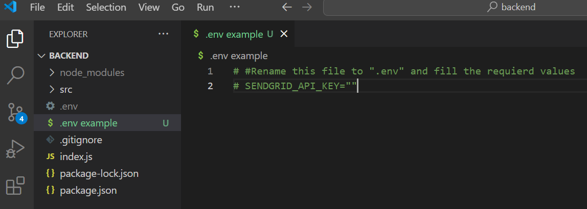
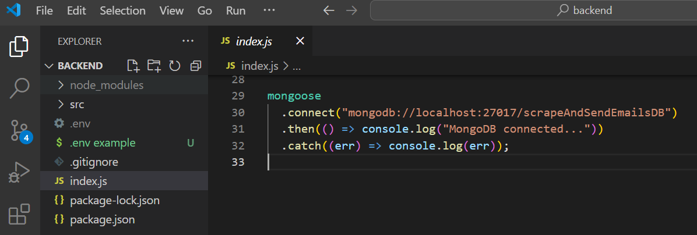

# Introduction

This project is dedicated to scrape emails from a public URL of a specific community. After that the user can send a custom emails to email addresses of a specific community in one click.

# Installation

In order to install the project

1. Clone github repo (both frontend and backend) into your code editor e.g. Visual Studio
2. Run `npm i` in both the frontend and backend project separately
3. Create account on Sendgrid and copy API key.
   - Rename `.env example` into `.env`
   - Add API KEY into `SENDGRID_API_KEY` variable and remove the `#` from beside it
     
4. Database:
   - Install `MongoDB` on your device
   - Install `mangoose` into your backend project using `npm i mongoose`
   - Add your DB connection string into the backend index.js file
     
