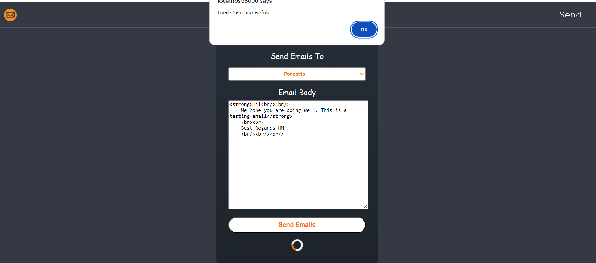

# Introduction

This project is dedicated to scrape emails from a public URL of a specific community. After that the user can send a custom emails to email addresses of a specific community in one click.

# Installation

In order to install the project

1. Clone github repo (both frontend and backend) into your code editor e.g. Visual Studio
2. Run `npm i` in both the frontend and backend project separately
3. Create account on Sendgrid

   - Click on `Create New Sender` under Marketing=> Senders  
     
   - Fill in all sender information
     
   - You will receieve a verification email
   - Copy API key from Email API => Integration Guide => Web API=> NodeJS.
   - Rename `.env example` into `.env`
   - Add API KEY into `SENDGRID_API_KEY` and sendgrid email into `SENDGRID_EMAIL` variable and remove the `#` from beside them
     
   - Lastly click on `Authenticate Your Domain` under Settings=> Sender Authentication
   - Follow the steps to installDNS Records by adding the records provided by Sendgrid to your domain DNS section

4. Database:
   - Install `MongoDB` on your device
   - Add your DB connection string into the backend index.js file or make its matching with existing port or update if needed
     
     -Import the JSON file containing the communities from the 'data' file in the repo using MongoDB Compass
     

# Usage

Scraping Emails

1. Choose targeted community from dropdown.
2. Another dropdown containing URLs will appear
3. Choose the URL you would like to scrape emails from and click on Scrape.
4. For now the only available URLs are for Podcast Communities
   
5. If some or all emails already exist, no records will be inserted
   

Sending Emails

1. Click on the Send in the right part of the Header
2. Select targetted community from the dropdown
3. Enter email content into the text box (accepts normal text or HTML).
4. Notice the placeholder inside the text box. You can create text variations using curly braces and pipes: e.g {Hello|Hi}. You can start a new line using  
5. Click on send emails
   

6. The email will be delivered with an unsubscribe button.
   
7. Once the user clicks on it, the user is redirected to another page which confirms the unsubscription.
   
